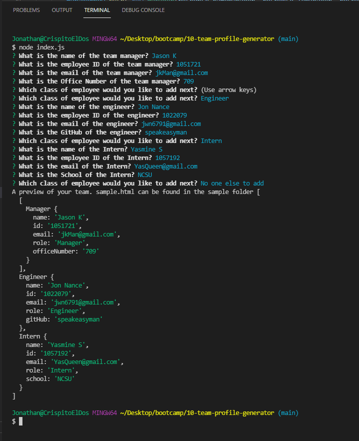
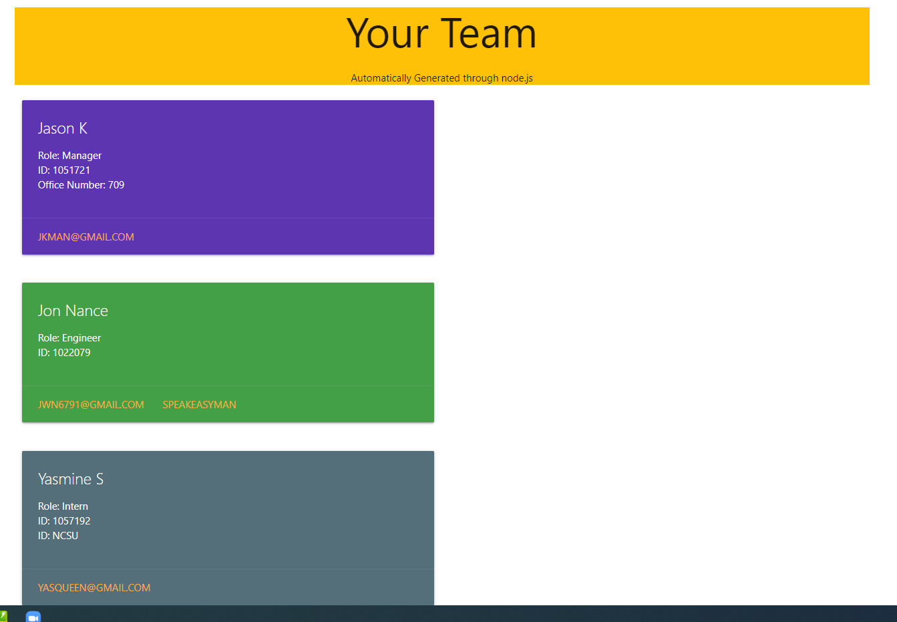

# 10-team-profile-generator
The week 10 homework: A Team Profile generator
1.0 Title:

    Team Builder

2.0 Introduction:

    The goal of this week's homework is to create a server that takes user inputs about team members 
    and renders html file with their team. Depending on what type of employee, different values will be populated.

3.0 Technologies:

    Node.js using the inquirer and jest modules are used mainly. Minimal html and materialize for styling.

4.0 Launch:

    A video can be located at 
    The repo is located at https://github.com/speakeasyman/10-team-profile-generator
    A copy of the sample.html can be located at https://github.com/speakeasyman/10-team-profile-generator/tree/main/sample

5.0 My Goals:

    My goal was to get this to work. I had some trouble with the scoping issue, and ended up having to generate the html by using different parts that is
    overall kind of Frankensteiny. In the end, there is a working product that meets the guidelines.

6.0 In use:

    You will need to do the npm installs including inquirer. If you would also like to run the test cases then jest would also be required.
    You can run it by typing node index.js in the terminal while being in the main folder.

    This is what the terminal looks like after adding one of each employee type and the corresponding rendered html.

